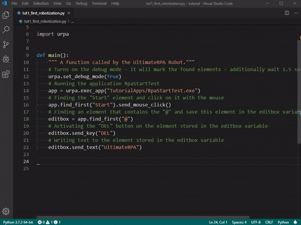

# Run Robot

Run Robot adds support for the [UltimateRPA](https://www.ultimaterpa.com) Robot to the Visual Studio Code.

## Features

- Run python script in UltimateRPA Robot with `Run Robot` command.

## How to use

1. Open UltimateRPA script.
2. Press `Ctrl+Shift+P`.
3. Type `Run Robot`.
4. Press enter.

or you can set [keyboard shortcut](https://code.visualstudio.com/docs/getstarted/keybindings) for the command.

## Requirements

You have to [download](https://client.ultimaterpa.com/sign/in?backlink=vnjtn) and 
[install](https://www.ultimaterpa.com/documentation/_install.html) the UltimateRPA Tools.

## Extension Settings

 `runRobot.robotPath`: Set your path for the UltimateRPA Robot.exe. Default value is set to `"C:/UltimateRPA/UltimateRPA Tools 4.5.0.0/Robot.exe"`.

## Known Issues

Submit the [issues](https://github.com/Slavaqq/runrobot/issues) if you find any bug or have any suggestion.

## Contribution

Fork the [repo](https://github.com/Slavaqq/runrobot) and submit pull requests.
